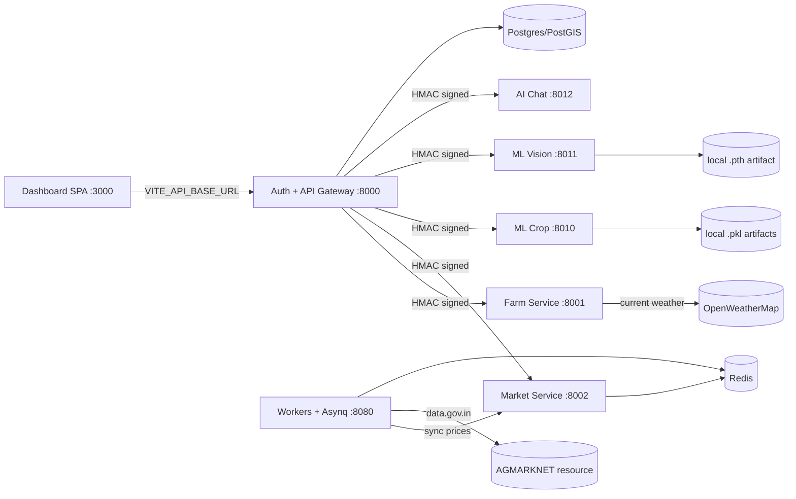

# Khetibadi 2.0

Khetibadi is an agricultural intelligence platform for Indian farmers. The current
stack runs as a single browser-facing app: the dashboard talks only to the auth
gateway on port `8000`; the gateway signs internal HMAC requests to farm, market,
ML, and chat services over the Docker network.

## What is wired today

- React dashboard on `http://localhost:3000` with the approved Soft Craft visual system.
- Auth gateway on `http://localhost:8000` with register/login/refresh/logout/password flows.
- Farm CRUD and soil samples, plus OpenWeatherMap current weather from farm boundary centroid.
- Market prices synced by workers from data.gov.in / AGMARKNET into the market service.
- Crop, yield, and fertilizer model training scripts with local artifact loading.
- Plant disease ResNet34 training script and local checkpoint loading.
- AI chat routes with explicit local fallback mode until Groq/RAG persistence is completed.

Several persistence layers are still in-memory while the no-mock readiness plan is being
implemented. Large datasets and trained model artifacts are intentionally ignored by Git.

## Architecture



## Required environment

Copy `.env.example` to `.env` and set real values. Never commit `.env`.

```bash
cp .env.example .env
```

Important keys:

| Variable | Purpose |
| --- | --- |
| `HMAC_SECRET` | Internal gateway-to-service request signing. |
| `JWT_SECRET` | Auth access token signing. |
| `OPENWEATHER_API_KEY` / `OPENWEATHERMAP_API_KEY` | Farm weather lookup by centroid. |
| `DATA_GOV_IN_API_KEY` | data.gov.in / AGMARKNET market price fetch. |
| `MARKET_DATA_API_URL` | data.gov.in resource URL, default resource `9ef84268-d588-465a-a308-a864a43d0070`. |
| `GROQ_API_KEY` | Required for real AI chat generation later. |
| `VITE_API_BASE_URL` | Browser API origin. Keep this as the only public API URL. |

Local fallback flags are present for development:

- `ML_ALLOW_STUB_MODE=true` lets ML services start if artifacts are missing.
- `AI_CHAT_ALLOW_FAKE_LLM=true` lets chat stream a deterministic local response.

Turn these off for no-mock validation once all artifacts and API keys are available.

## Start the stack

```bash
docker compose up -d --build
docker compose ps
```

Open the dashboard at `http://localhost:3000`.

## Train and place ML artifacts

Datasets are downloaded under `data/` and artifacts under service `models/` directories.
Both locations are gitignored. Training scripts save metadata next to each artifact.

### Kaggle tabular datasets

If `KAGGLE_API_TOKEN` is present in your local `.env`, download the preferred Indian
tabular datasets first:

```bash
set -a && source .env && set +a
uvx --from kaggle kaggle datasets download \
  atharvaingle/crop-recommendation-dataset \
  -p data/kaggle/crop-recommendation --unzip -o -q
uvx --from kaggle kaggle datasets download \
  nikhilmahajan29/crop-production-statistics-india \
  -p data/kaggle/crop-production-statistics-india --unzip -o -q
uvx --from kaggle kaggle datasets download \
  sanchitagholap/crop-and-fertilizer-dataset-for-westernmaharashtra \
  -p data/kaggle/fertilizer-western-maharashtra --unzip -o -q
```

The training scripts default to these ignored Kaggle paths and keep the dataset source
reference in model metadata.

### Crop recommendation

```bash
uv run --project apps/ml-crop \
  python apps/ml-crop/scripts/train_crop.py
```

Outputs:

- `data/kaggle/crop-recommendation/Crop_recommendation.csv`
- `apps/ml-crop/models/crop_model.pkl`

### Yield prediction

```bash
uv run --project apps/ml-crop \
  python apps/ml-crop/scripts/train_yield.py
```

Outputs:

- `data/kaggle/crop-production-statistics-india/APY.csv`
- `apps/ml-crop/models/yield_model.pkl`

### Fertilizer recommendation

```bash
uv run --project apps/ml-crop \
  python apps/ml-crop/scripts/train_fertilizer.py
```

Outputs:

- `data/kaggle/fertilizer-western-maharashtra/Crop and fertilizer dataset.csv`
- `apps/ml-crop/models/fertilizer_model.pkl`

### Plant disease detection

Prepare a PlantVillage-style ImageFolder dataset locally:

```text
data/vision/plantvillage/
  apple_healthy/
    img001.jpg
  tomato_late_blight/
    img002.jpg
```

Then train ResNet34:

```bash
uv run --project apps/ml-vision \
  python apps/ml-vision/scripts/train_vision.py \
  --dataset-dir data/vision/plantvillage \
  --output apps/ml-vision/models/resnet34_plantvillage.pth
```

Use Kaggle, Mendeley PlantVillage, TFDS PlantVillage, or an approved local field-image
dataset. Do not commit image datasets or `.pth` files.

With `KAGGLE_API_TOKEN`, the preferred local PlantVillage baseline is:

```bash
set -a && source .env && set +a
uvx --from kaggle kaggle datasets download \
  mustafaberatyavas/plantvillage-dataset \
  -p data/kaggle/plantvillage-dataset --unzip -o -q
uv run --project apps/ml-vision \
  python apps/ml-vision/scripts/train_vision.py \
  --dataset-dir data/kaggle/plantvillage-dataset/PlantVillage/raw \
  --output apps/ml-vision/models/resnet34_plantvillage.pth
```

## Verification commands

Run Go checks:

```bash
export PATH="$HOME/go/bin:$PATH"
for svc in apps/auth apps/farm-service apps/market-service apps/workers packages/go-shared; do
  (cd "$svc" && go test ./... && go build ./... && golangci-lint run ./...)
done
```

Run Python checks:

```bash
for svc in apps/ml-crop apps/ml-vision apps/ai-chat; do
  (cd "$svc" && uv run ruff check . && uv run mypy . && uv run pytest tests/ -v)
done
```

Run frontend checks:

```bash
bun run lint
bun run type-check
bun run build
```

Validate compose:

```bash
docker compose config --quiet
docker compose up -d --build
```

## Current OpenSpec comparison

Implemented vertical slice:

- Single public API origin through auth gateway.
- Browser CORS + HttpOnly refresh-cookie bootstrap on hard reload.
- HMAC-protected downstream service routes.
- Live data.gov.in market fetch via workers.
- OpenWeatherMap farm weather lookup.
- Real local model artifact loading for crop, yield, fertilizer, and vision.
- Deep Playwright verification of auth, dashboard, farm, crop, market, disease scan,
  AI assistant, settings, and logout flows after the Soft Craft redesign.

Still planned in `openspec/changes/no-mock-model-data-readiness`:

- Postgres/sqlc persistence for auth, farms, market prices, alerts, chat, and refresh tokens.
- Redis-backed weather and market caches instead of in-memory maps.
- Redis-backed ml-vision async job result store.
- Real Groq + pgvector RAG implementation for AI chat.
- Production-mode fallback flags off by default in compose profiles.
- Broader automated Playwright suite checked into source.

## Security and artifact rules

- Do not commit `.env`, API keys, datasets, or model checkpoints.
- `data/**`, `*.pkl`, `*.pth`, `*.pt`, `*.onnx`, and model metadata sidecars are ignored.
- Rotate keys that were ever hardcoded in older repositories before production use.
