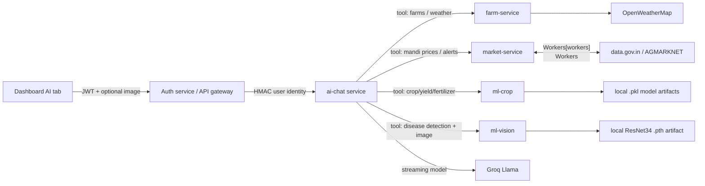
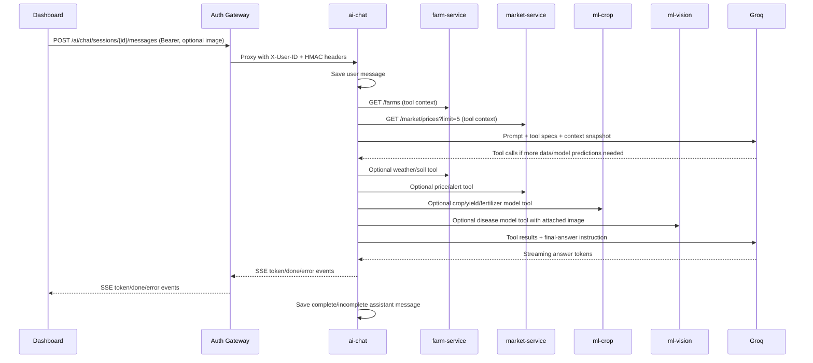
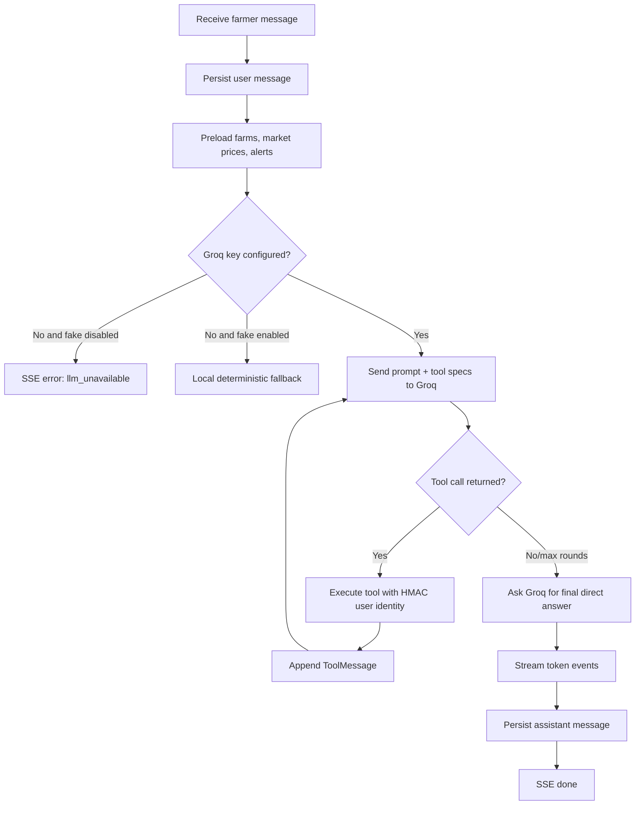
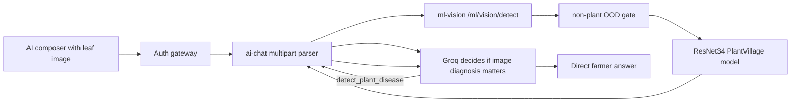

# Khetibadi AI Agent Architecture

This document explains how the AI assistant answers with farmer-specific context, calls tools on demand, uses model services, and supports image attachments.

## Goals

- Answer directly first, without sympathy/filler.
- Use the authenticated farmer's farms, weather, market prices, alerts, crop models, and disease model when needed.
- Allow an attached crop image so the assistant can call the plant disease detector.
- Keep browser traffic on the single public API gateway (`auth:8000`).
- Continue in degraded mode when a context tool is temporarily unavailable.

## High-level architecture

## Low-level request flow

## Tool list

| Tool | Downstream service | Purpose |
|---|---|---|
| `get_farms` | `farm-service` | Fetch authenticated farmer's farms, crop, soil type, area, boundaries. |
| `get_farm_weather` | `farm-service` | Fetch current OpenWeatherMap weather for a farm. |
| `get_soil_samples` | `farm-service` | Fetch soil sample history for a farm. |
| `get_market_prices` | `market-service` | Fetch latest mandi prices filtered by commodity/state. |
| `get_market_alerts` | `market-service` | Fetch user's price alerts. |
| `recommend_crop` | `ml-crop` | Run crop recommendation model. |
| `predict_yield` | `ml-crop` | Run yield model. |
| `recommend_fertilizer` | `ml-crop` | Run fertilizer model. |
| `detect_plant_disease` | `ml-vision` | Run plant disease model on the attached image. |

## Agent loop

## Security and identity

- The browser sends only the access token to the public auth gateway.
- The auth gateway validates JWT and forwards internal requests with `X-User-ID`, `X-Timestamp`, and `X-HMAC-Signature`.
- The AI service re-signs tool calls with the same HMAC formula used by downstream services.
- Tool calls are scoped to the authenticated farmer's `user_id`.
- API keys remain in `.env` and container environment only; they are never committed.

## Image attachment flow

## Frontend behavior

- The AI tab supports text plus an optional JPEG/PNG leaf image.
- SSE events are parsed in the browser; only assistant text is shown.
- Raw `event:` / `data:` JSON is not displayed.
- When streaming finishes, the dashboard refreshes chat history and clears the transient stream bubble.

## Current implementation limits

- Chat sessions/messages are still in memory; Postgres persistence is planned.
- RAG knowledge is still in-memory text chunks; pgvector retrieval is planned.
- Redis-backed rate limiting is planned; current rate limiting is in memory.
- Tool-calling is real, but the model may choose not to call a tool if the prompt is general.
- Vision non-plant detection is a heuristic OOD gate; a production-grade gate needs negative examples and calibration.
